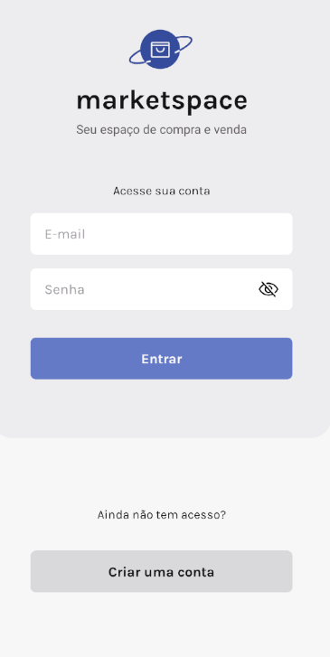

# Marketspace

---

## Sobre

> O aplicativo oferece a flexibilidade de registrar informações detalhadas sobre seus produtos, possibilitando que eles sejam exibidos de maneira eficaz na plataforma. Dentro do aplicativo, você pode realizar uma variedade de ações, como cadastrar novos produtos, fazer edições, gerenciar seus anúncios e usar a busca avançada para encontrar exatamente o que procura.

## Dependências

- Node.js(LTS);
- npm;
- expo-cli;
- AsyncStorage;
- Expo GO;
- NativeBase.

---

## Dispositivos Virtuais

- Emulador Android: **Android Studio**
- iOS Simulator: **XCode**

---
## Configuração do Ambiente

### Crie uma pasta

~~~
$ mkdir <nome>
~~~

### Faça uma cópia do projeto dentro da pasta criada:

ssh - App mobile
~~~
$ git clone git@github.com:haruoSugano/marketspace-mobile.git
~~~

ssh - Backend da aplicação
~~~
$ git clone git@github.com:rocketseat-education/ignite-rn-2022-challenge-marketspace-api.git
~~~

https - App mobile
~~~
$ git clone https://github.com/haruoSugano/marketspace-mobile.git
~~~

https - Backend da aplicação
~~~
$ git clone git@github.com:rocketseat-education/ignite-rn-2022-challenge-marketspace-api.git
~~~

---

### Baixe as dependências:

App mobile:

~~~
$ cd marketspace
~~~

Digite o comando:
~~~
$ npm install
~~~

Backend:

~~~
$ cd ignite-rn-2022-challenge-marketspace-api
~~~

Digite o comando:
~~~
$ npm install
~~~

### Baixe as dependências:

Configure o arquivo .env

~~~
$ cp .env.copy .env
~~~

~~~
EXPO_PUBLIC_IP_LOCAL=""
~~~

### Execução:

~~~
$ expo start
~~~ 

Para Android digite:
~~~
$ a
~~~